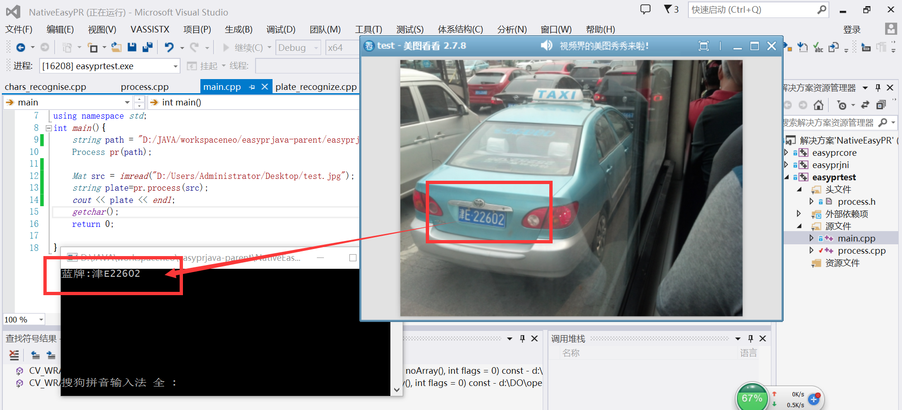

克隆代码之后初始化更新一下子模块 git submodule update --init --recursive

### 替换文件
+ 替换EasyPR文件，替换所需文件在[EasyPR-change](../EasyPR-change)下，一共三个文件,同名替换，也可以参考修改即可
  + 替换[EasyPR/include/easypr/core](../EasyPR/include/easypr/core)下的[chars_identify.h](../EasyPR/include/easypr/core/chars_identify.h)头文件
  + 替换[EasyPR/src/core](../EasyPR/src/core)下的[chars_identify.cpp](../EasyPR/src/core/chars_identify.cpp)源文件
  + 替换[EasyPR/src/core](../EasyPR/src/core)下的[plate_judge.cpp](../EasyPR/src/core/plate_judge.cpp)源文件


### opencv环境变量设置
##### windows
+ 去官网下载opencv3.1.0之后，假设opencv根目录为xxx, 则需把xxx\build\x64\vc12\bin加进系统path环境变量下
+ 安装java环境，添加环境变量jdk的根目录%JAVA_HOME%
+ 然后用vs2013打开[NativeEasyPR.sln](NativeEasyPR.sln)即可，生成对应的包，在配置管理器里面配置需要生成的目标
+ 我这里以release_x64为例，有用的三个文件会在当前路径/x64/Release下生成
    - easypr.exe 单机测试 修改测试路径请修改 easypertest/main.cpp代码
    - easyprjni.dll java调用需要
    - easyprexport.dll python和go语言调用需要

#### linux 
+ 官网下载opencv3.1.0源码包，根据不同系统安装，目前主要是centos和ubuntu，具体安装方法，移步百度谷歌
+ 下载cmake,我在centos下无法安装最新版camke,默认是2.8 无法编译，所以需要下载源码编译，具体安装方法，移步百度谷歌
+ 编译NativeEasyPR
```
$ cd进入NativeEasyPR
$ mkdir build
$ cd build
$ cmake ..
$ make -j8
```
+ 有用的三个文件会在当前路径build目录下生成
    - easypr 单机测试 修改测试路径请修改 easypertest/main.cpp代码
    - libeasyprjni.so java调用需要 重命名easyprjni.so
    - libeasyprexport.so python语言调用需要 easyprexport.so

###　原生c++测试效果如下图
